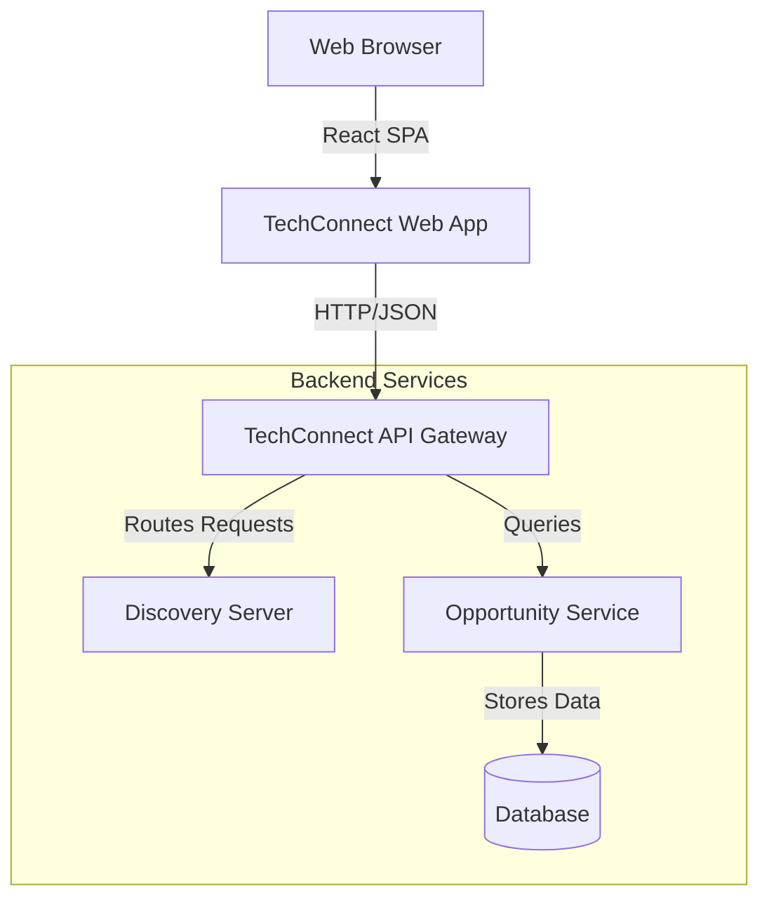

# System Context

This document explains how the **TechConnect Web Application** interacts with the rest of the TechConnect ecosystem.

## Overview

The TechConnect ecosystem is a microservices-based architecture designed to connect technology professionals with opportunities. The web application serves as the primary user interface for this system.

## Key Components

### 1. TechConnect API Gateway
The central entry point for all frontend requests. It handles routing, potentially authentication, and abstracts the underlying microservices.
- **Port**: Usually `8080`
- **Repo**: `TechConnect-API-Gateway`

### 2. TechConnect Discovery Server
Handles service registration and discovery, allowing services to find each other without hardcoded addresses.
- **Repo**: `TechConnect-Discovery-Server`

### 3. TechConnect Opportunity Service
The core business service that manages the lifecycle of opportunities (creation, listing, updating, deleting).
- **Repo**: `TechConnect-Opportunity-Service`

## Integration Point

The frontend communicates exclusively with the **API Gateway**. It does not talk directly to the backend microservices. The base URL for all API calls is configured via the `VITE_API_GATEWAY_URL` environment variable.

See [API Integration](../reference/api-integration.md) for technical implementation details.
